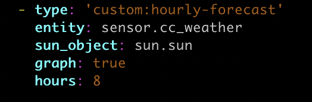

# Hourly Forecast Card

This card provides for the display of the hourly forecast in the climacell provider.

## Installation
Configure a custom repository as follows:
* URL: https://github.com/jmutnick/hourly-forecast
* Category: Plugin

## Dependancies
* The Climacell weather provider is required.  This can be found in the HACS store.  More information is here:  https://github.com/r-renato/ha-climacell-weather

* The sun integration is required to detemine you local sunrise and sunset so that the hourly forecast can display the correct icons.  More information about this integration can be found here.  https://www.home-assistant.io/integrations/sun/

## Configuration

This is an example config.  The entity is the prefix for the climacell provider.

