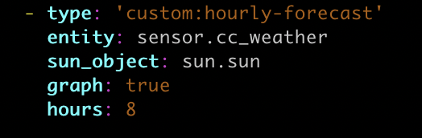

# Hourly Forecast Card

This card provides for the display of the hourly forecast in the climacell provider.

## Dependancies
* The Climacell weather provider is required.  This can be found in the HACS store.  More information is [here](https://github.com/r-renato/ha-climacell-weather)

* The sun integration is required to detemine you local sunrise and sunset so that the hourly forecast can display the correct icons.  More information about this integration can be found [here](https://www.home-assistant.io/integrations/sun/)

## Configuration

Because of a problem with hourly forecasts, a separate  sensor is needed for the weather_condition monitored condition.

This is the first sensor:

```
- platform: climacell
  api_key: !secret climacell_api
  name: weather
  latitude: !secret home_latitude
  longitude: !secret home_longitude
  monitored_conditions:
    hourly:
      forecast_observations: 8
      conditions:
        - temperature
        - precipitation
        - precipitation_probability
        - humidity
        - feels_like
  scan_interval:
    days: 0
    hours: 0
    minutes: 5
    seconds: 0
    milliseconds: 0
```

This is the second sensor:
```
- platform: climacell
  api_key: !secret climacell_api
  name: weather2
  latitude: !secret home_latitude
  longitude: !secret home_longitude
  monitored_conditions:
    hourly:
      forecast_observations: 8
      conditions:
        - weather_condition
  scan_interval:
    days: 0
    hours: 0
    minutes: 5
    seconds: 0
    milliseconds: 0
```

This is an example config.  The entity is the prefix for the climacell provider.


